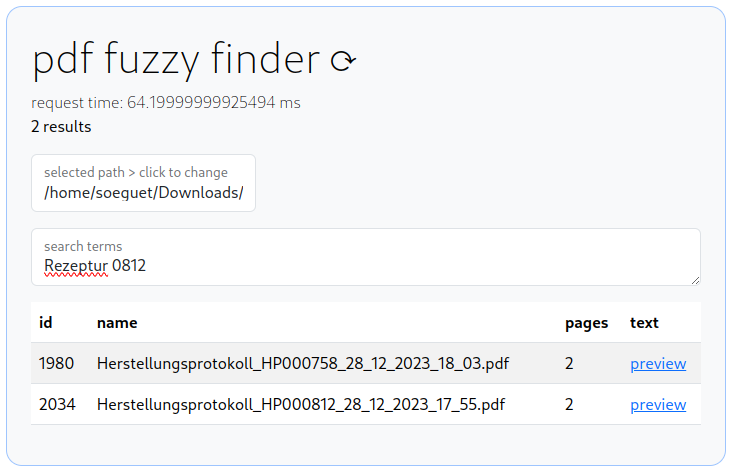
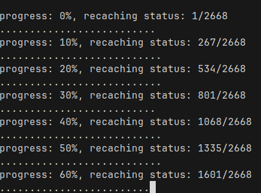
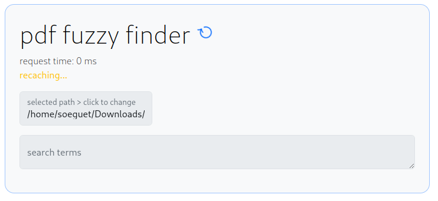
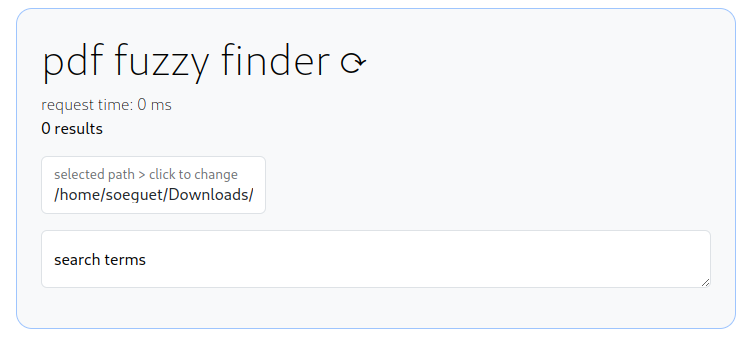

# aiv4u

fuzzy finder for local PDFs.


Since we were in need of a fuzzy finder for around 2,700 PDFs containing sensitive information at work, I tried to fill this gap with this locally operating application.

The backend is powered by NodeJS (with ECMAScript modules), the frontend is run by HTML + Vanilla Javascript + BootstrapCSS.
After parsing the PDFs, the text is cached in a sqlite database.
I tried to achieve type safety with JSDocs + using a Typescript-LSP.

# technologies

    -   NodeJs 20+
    -   npm 10+
    -   express 4.18+
    -   pdf-parse-fork 1.2+
    -   sqlite3 5.1+

# run project
```sh
npm install
```
```sh
node ./backend/server.mjs
```

the frontend is available [@http://localhost:3000](http://localhost:3000)

# screenshots





